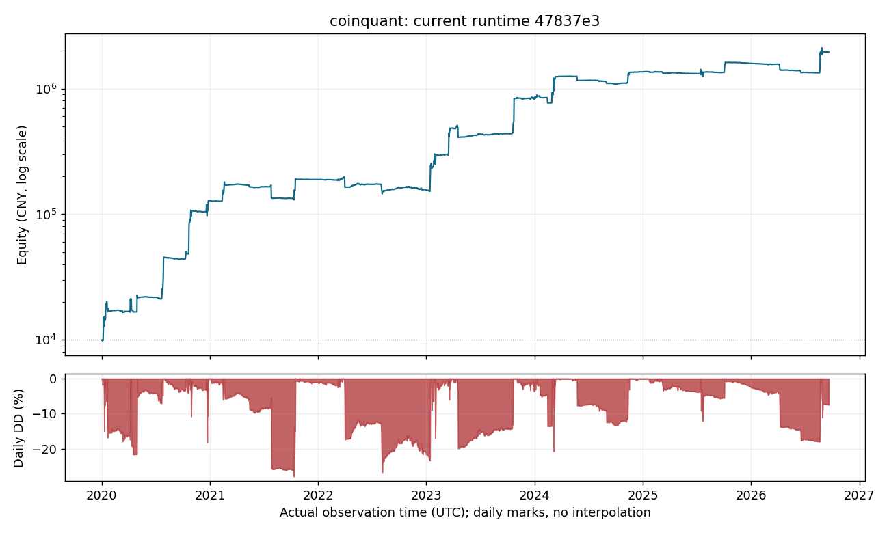

# 当前版本完整回测

2026-10-06（Asia/Shanghai）完成。测量运行代码为 [`47837e3`](https://github.com/geniusgrok/coinquant/tree/47837e391be4130104967d794e9701068a0bcc5a)，策略为 **SX60 + DFII10; primary risk 7.5 / macro risk 3.6**。

| 指标 | 结果 |
|---|---:|
| 初始资金 | 10,000.00 元 |
| 期末人民币权益 | 1,951,753.81 元 |
| 累计净收益 | 19,417.54% |
| 人民币年化净收益 | 119.23% |
| 人民币路径最大回撤代理 | 44.11% |
| 日观测最大回撤 | 27.90% |
| 实际模拟成交笔数 | 1,561 |
| 成交手续费 | 15,290.5450 USDT |
| 净支付资金费 | 21,733.1561 USDT |
| 历史会话 | 795 / 795 |

独立账户以 1 万元启动，不追加或提取资金；UTC 窗口为 **2020-01-01 00:00:00 至 2026-09-20 00:00:00，末端不含**。每次会话 300 秒、轮询 5 秒，读延迟 0.2 秒、写延迟 1 秒。最终持仓按末端价格估值，不为窗口结束强制造成交。始末换汇各扣 0.1%，汇率使用当时已可得的历史参考值；USD/USDT 按平价估值。成交手续费为 0.075%，另计历史资金费；买卖报价与可成交深度来自单层代理。

年化采用 `(期末人民币权益 / 10000) ** (1 / 年数) - 1`，每年 365.2425 天。人民币指标包含汇率变化。生产者已在完成时核对成交、费用与资金账本，结果通过；本报告直接导出该结果。

图和 [日权益 CSV](backtest/daily-equity.csv) 保留生产者实际观测时间，不填补每日点或重构未记录的账户路径。图中的日观测回撤可能低于表中日内路径最大回撤代理。[机器可读结果](backtest/summary.json) 保留精确资金、测量源码、输入身份、成本和生产者账本核对结果。

使用历史成交打印、分钟标记价格和交易价格包络。盘口深度、逐仓维持保证金及缺失标记价格的扩大区间仍为代理；缺口区间可能使用全窗口观测边界。 回测执行与保护成交均为历史模拟，不能证明交易所真实委托、重启或止损触发能力。该历史窗口曾用于策略开发，因此本结果不构成独立样本外 alpha 或未来收益证明；实际账户观察天数为 0。

生产者的单层盘口由上一分钟成交量即时构造，IOC 使用一秒打印匹配，保护触发按零额外滑点成交；维持保证金率和缺失标记价也使用代理。这些假设不能给出真实可成交容量或回撤上界。后续 Demo 应以原生报价、委托到回读耗时、实际成交价及保护触发滑点校准；本表仍只对应上方 `47837e3` 源码与每 300 秒启动一次的历史会话，不能外推到任意人工启动节奏或改动后的代码。

原始回执、运行注册与离线方法保存在 [本次回测归档分支](https://github.com/geniusgrok/coinquant/tree/archive/backtest-main-20261006/backtest-source)。main 展示文档的提交不会改变测量源码身份。
