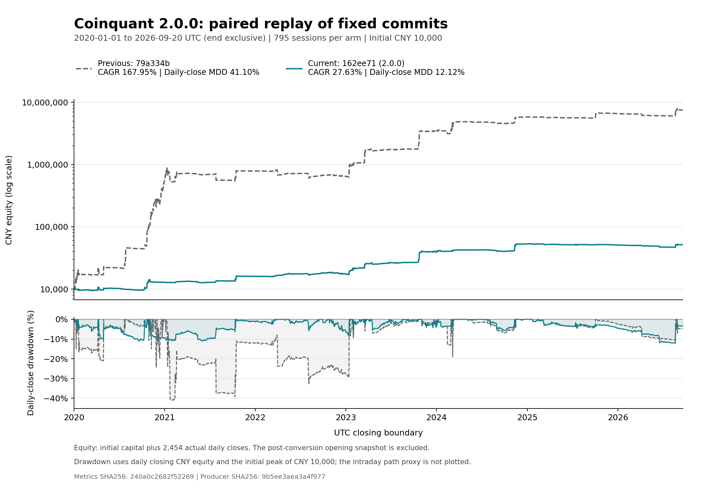

# Coinquant 2.0.0：修复后同口径重测

**当前固定源码的成本后年化为 27.6264%，原模拟路径最大回撤代理为 15.1634%，日收盘最大回撤为 12.1154%。**

本次测量于 2026-10-09 完成，两臂各完成原 795 次会话，并通过独立财务、保留权益路径逐点回撤重算和账户状态审计。旧版同源码仍复现 167.9487% 年化，当前版较低的收益及回撤来自本次完整版本比较的实际结果。当前源码仍是 [tag 2.0.0](https://github.com/geniusgrok/coinquant/tree/162ee7138952925ffafbc9b68be7c754c0c0a6c3)。

## 查看证据

- [机器指标](metrics.json)：完整计算精度、财务、仓位、分年结果、差异及旧记录校准。
- [结果表](RESULTS.md)、[日权益与日收盘回撤 PNG](equity-drawdown.png)、[SVG](equity-drawdown.svg)。
- [独立财务与路径审计](full-audit-summary.json)、[previous 状态审计](state-audit-previous.json)、[current 状态审计](state-audit-current.json)。
- [协议](PROTOCOL.md)、[复核方法](REPRODUCE.md)、[输入清单](inputs/INPUT_MANIFEST.json)、[逐笔缓存校验](inputs/CACHE_VALIDATION.json)。
- [完整原件附件](https://github.com/geniusgrok/coinquant/releases/download/2.0.0/coinquant-2.0.0-remeasurement-evidence-20261009.tar.xz)、[附件身份](PUBLIC_PACKAGE.json)、[逐文件清单](EVIDENCE_FILES.json)、[本目录 SHA256](SHA256SUMS)。

## 测量结果

previous `79a334b2d776be2dbe8756f3a616697f9403982e` → current `162ee7138952925ffafbc9b68be7c754c0c0a6c3`。
两臂均完成原 795 次会话，独立账本审计及完整保留路径的重算审计通过。

窗口为 2020-01-01 00:00 UTC 至 2026-09-20 00:00 UTC（终点排除），2454 天；初始资金 10,000 CNY。CAGR 使用 365.2425 天/年。

| 指标 | previous，同 producer 重测 | current，2.0.0 |
|---|---:|---:|
| 成本后 CAGR | 167.9487% | 27.6264% |
| 期末权益 / CNY | 7,516,290.02 | 51,498.50 |
| 全期日权益收益率 | 75,062.9002% | 414.9850% |
| 原模拟路径 MDD 代理 | 46.2720% | 15.1634% |
| 日收盘 MDD | 41.1043% | 12.1154% |
| close 观测 MDD 代理 | 46.0123% | 14.8997% |
| 净手续费 / USDT | 38,661.63 | 257.23 |
| 保险扣费 / USDT | 0.00 | 0.00 |
| 净支付资金费 / USDT | 75,628.89 | 282.66 |
| 成交记录 / 已成交普通订单 | 3079 / 301 | 142 / 93 |
| 期末有符号持仓 / BTC | 0.00000000 | 0.00000000 |
| cleanup verified / 全部会话 | 795 / 795 | 795 / 795 |
| 期末 pending / 未解决执行会话 | 0 / 0 | 0 / 0 |
| 会话报告错误条目 | 735 | 1065 |

## 分年日权益收益与回撤

沿同一复利账户路径计算；2020 年从 10,000 CNY 起算，后续每年包含上年末权益作为初始峰值。2026 年为截至 9 月 19 日日终的部分年度收益。

| 年度 | previous 收益率 | current 收益率 | previous 日收盘 MDD | current 日收盘 MDD |
|---|---:|---:|---:|---:|
| 2020 | 5,545.0320% | 28.7629% | 24.2920% | 10.9669% |
| 2021 | 39.2062% | 23.9873% | 41.1043% | 5.4528% |
| 2022 | -18.0243% | 8.8300% | 26.9575% | 6.4711% |
| 2023 | 427.9402% | 126.4982% | 9.4226% | 7.8805% |
| 2024 | 71.0027% | 35.0296% | 18.9793% | 5.6877% |
| 2025 | 13.2998% | -4.0669% | 4.4199% | 4.6213% |
| 2026 | 14.0715% | 1.0220% | 8.3006% | 7.9780% |

## 历史 PR74 数字校准

以下单独比较旧发布记录与本次对同一 previous SHA 的重测。旧 producer 与本次 producer 的身份不作相同声明；差异完整保留，不据此推测原因。

| 指标 | 旧记录 | 本次 previous 重测 | 差值 / 百分点 |
|---|---:|---:|---:|
| CAGR | 167.94868978615018% | 167.9486897862% | -3.45731376E-14 |
| 路径 MDD 代理 | 46.27197712514759% | 46.2719771251% | -5.31916794E-16 |

净支付资金费为正表示净支出，为负表示净收入。日收盘回撤由 `financial.daily` 逐日重算；`mdd_close` 是原 close 观测代理，单独列示。

路径代理仍包含原 OHLC 极值先后、print/mark 代理及 hindsight 缺口界限。表格作展示舍入，metrics.json 保留未舍入值、审计身份和期末仓位细节。

## 如何理解差异

本轮比较包含两个完整版本的差异。除了默认止损预算从 `.49` 调整为 `.10`、逐仓保证金上限和持仓/恢复逻辑，2.0.0 还新增了发单前盘口一致性复核：关键价格、限价内深度、容量或报价所属模型时段不符合定仓计划时，该次入场不发送，后续轮询需重新取得有效观察。这些变化共同改变实际执行路径；本轮年化与回撤差值不能单独归因于某一个风险参数。见[最终盘口复核](https://github.com/geniusgrok/coinquant/blob/162ee7138952925ffafbc9b68be7c754c0c0a6c3/coinquant/native_preview.py#L389)。

当前版本的止损损失预算有 10% 硬上限，DFII10 模型预算为 3%，逐仓保证金上限为可核实资金的 25%。这些不是账户最大回撤保证。前后版本已成交普通订单分别为 301 / 93，成交记录分别为 3079 / 142；成交记录可含部分成交，不能当作完整买卖轮次。复利资金路径和执行机会共同变化，不做单因素因果归因。

2025 年 current 收益为 −4.0669%，2026 年截至 9 月 19 日日终的 262 日收益为 +1.0220%。当前全期日收盘最大回撤从 2025-01-09 的峰值延续至 2026-08-19 的低点，不能用任意一个单年回撤替代。

## 固定经济条件与模拟边界

- BTCUSDT USDT 本位永续，2020-01-01 00:00 至 2026-09-20 00:00 UTC（终点排除），2454 天；初始 10000 CNY，无外部追加。
- 原 795 次 300 秒会话、5 秒轮询；读/写延迟 200/1000 ms。每臂使用真实生产 `session.run`、正常账户锁、连续模拟钱包及该版本默认配置。
- 每笔成交费率 0.075%，计原官方资金费；换汇两端各 0.1%，USD/USDT 沿原口径按平价估值。CAGR 年长为 365.2425 天。
- 保留原行情、ALFRED vintage、warmup、合约规则、解析及事件排序。Python 3.12.14 是本轮实际研究解释器；面向用户的程序安装说明为 Python 3.13。
- 原单层深度/成交量代理、未来一秒整笔量 IOC 上界、完整保护成交、固定维持保证金和零额外退出滑点均保留。配置中的 1% 逆向滑点仅用于风险定量，不表示模拟撮合另加了 1% 退出滑点。
- 缺失标记分钟仍使用原 hindsight bound，previous/current 为 53/29 分钟；原事件顺序分别包含 663/371 次时间戳倒退。完整轨迹逐点留存、按原顺序复算，没有排序或插值改善结果。
- 原窗口参与过开发，人工会话日程影响响应。路径 MDD 是原模拟代理，`mdd_close` 是密集 close 观测代理，日收盘 MDD 单独计算；它们都不等同于真实连续交易所或样本外验证。本轮没有真实账户执行，原生 Demo 验收仍未完成。

## 审计与完整性

独立审计对 previous/current 分别复核 3079/142 条成交、4275/926 条收入和 1147/740 次持仓资金费事件；两臂费用、官方资金费、钱包与期末估值核对通过，保险扣费均为零。分别保留并复算 2544832/1763276 个权益观测点，分段 gzip、序号、滚动 SHA、检查点与报告前缀均一致。审计保留 32678 个结构化差异，不对臂间经济差异施加容差；仅账本闭合使用原 1e-8 USDT 数值容差。

两臂各 795 次真实生产会话，正常账户锁调用各 795 次。每份会话均 `cleanup=verified`、`pending_intents=0`、`execution_unresolved=false`；130/81 个持仓会话终点分别通过整仓原生保护与止损强平缓冲检查。两臂最终持仓、活动保护均为零。

每份会话报告只保留最后 10 条错误，因此这些数值不是所有失败尝试或交易所拒单的总次数。当前版有 42 份报告保留发单前盘口一致性检查错误，共 296 条；部分会话后续仍成功成交。保留错误还包括期限耗尽、保护价格限制和观察不可得，cleanup 通过不能写成“没有错误”。

本地状态审计与模拟期末账本审计分别报告：当前本地 income coverage 截至 2026-09-18 00:05:02.4 UTC，`wallet_closure="collected"`、`closure=null`；全部 142 条模拟成交与 926 条收入恰好均已归档，未归档列表为空，但不据此把本地 coverage 延长至 9 月 20 日。完整模拟期末钱包与权益由独立财务审计核对。

报告保留错误及最终状态见 [report-errors.json](report-errors.json)：previous/current 分别为 735/1065 条错误、675/722 份含错报告；最终报告状态分别为 no_action 738/754、executed 56/36、blocked 1/0、unknown 0/5。这些状态反映报告最后一轮的观察，`no_action` 不代表整个会话没有成交，`executed` 数量也不是全部成交会话数；不能据此修改实际成交或把清理通过解释为无错误。

1164 个原输入实际恢复并核验，共 14309495767 字节，零失败。773 份逐笔解析缓存的压缩与解压后摘要、完整性、原行数和 ABI 已独立校验，共 1085892704 条原解析记录。冻结 loader 本身不读取缓存 sidecar 或验证 packed SHA；这些属于另外完成的独立核验，见缓存报告。

## 执行与后处理记录

第一次尝试在 previous 478/795 时因 gzip 路径不完整失败，缺失 147543 个观测点。原回执、失败标志、路径和状态完整保留，该次不形成经济结果，也未从失败检查点续跑。第二次仅改变证据保存 I/O，新 producer 下从头串行运行两臂；前 478 份完成报告与第一次对应前缀逐字节一致。见 [ATTEMPTS.json](ATTEMPTS.json)、[失败诊断](TRACE_FAILURE_DIAGNOSIS.json)、[I/O 适配](tooling/ADAPTATION.md)、[前缀比较](FIRST_ATTEMPT_PREFIX_COMPARISON.json)。

完整财务/路径审计通过后，指标汇总器发现其终态检查把空列表字段 `sqlite.pending` 错写成整数比较。已改为严格要求 `[]`，真实回执、审计、生产代码、producer、输入与测量数值均未改动；失败调用未创建指标文件。单行差异与原/新摘要见 [POSTPROCESSING_FIX.json](POSTPROCESSING_FIX.json)。之后指标生成与图表全量数值一致性检查均通过。

原始模拟账户数据库及首次失败状态只交付委托者留存，不提交公共仓库。公开附件包含完整成功回执、报告、生产调用计数、检查点、压缩权益轨迹与详细差异审计。主分支保持当前交易程序与必要说明，研究工具和结果留在本证据分支。
